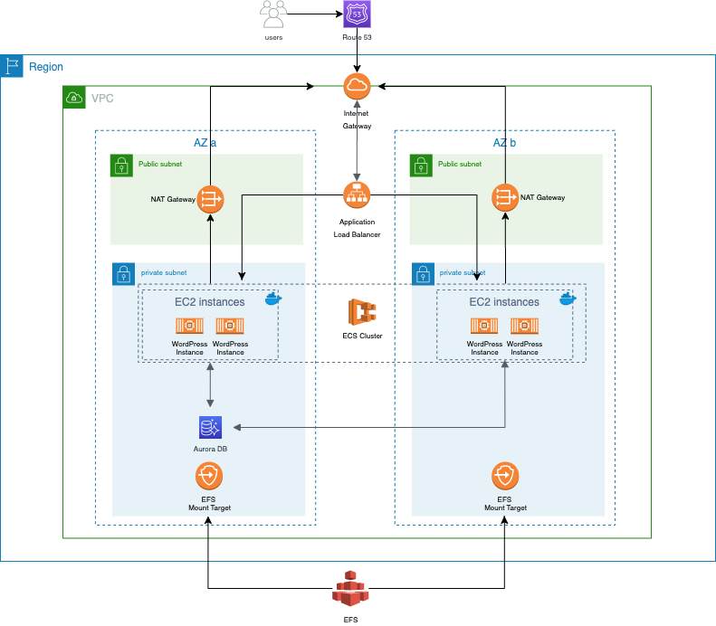

[![Contributors][contributors-shield]][contributors-url]
[![Forks][forks-shield]][forks-url]
[![Stargazers][stars-shield]][stars-url]
[![Issues][issues-shield]][issues-url]
[![MIT License][license-shield]][license-url]

# Moving a WordPress-based application from on-premise to a cloud-hosted solution

<!-- TABLE OF CONTENTS -->
## Table of Contents

<!-- Start Document Outline -->

* [About The Project](#about-the-project)
	* [Solution Diagram](#solution-diagram)
	* [Technologies](#technologies)
* [Documents Index](#documents-index)
* [Getting Started](#getting-started)
	* [Prerequisites](#prerequisites)
* [Usage](#usage)
* [How To's](#how-tos)
	* [Initiate the infrastructure](#initiate-the-infrastructure)
	* [Update the docker image in the ECR](#update-the-docker-image-in-the-ecr)
	* [Deploy a new docker image to the ECS](#deploy-a-new-docker-image-to-the-ecs)
	* [Remove the resources created](#remove-the-resources-created)
	* [Change the name of the project](#change-the-name-of-the-project)
	* [Change the name of the ECR repository](#change-the-name-of-the-ecr-repository)
	* [Change the ECR repository location to another AWS account](#change-the-ecr-repository-location-to-another-aws-account)
	* [Use S3 as terraform backend](#use-s3-as-terraform-backend)
* [Roadmap](#roadmap)
* [Contributing](#contributing)
* [License](#license)
* [Contact](#contact)

<!-- End Document Outline -->


## About The Project
This project aims to move a web application from on-premise to a cloud-hosted solution.

Currently, the WordPress-based application uses LAMP stack (Linux, Apache, MySQL, and PHP) and the solution is hosted in a single server (application and database) where the deployments are made through FTP transfers to the server.

This cloud migration is designed to comply with the following requirements:

- The application must be containerized;
- The application must to be secure (all data encrypted at rest and in transit)
- The application must to be highly available.
- The application must to support peaks of up to 10 times the average load (scalability).
- The infrastructure must to be reproducible and version-controlled in case the CEO decides to expand the business to other parts of the world (consider infra as code).
- There must be an easy and secure way of developing, with fast feedback  (consider CI/CD practices or at least automation scripts)

### Solution Diagram


### Technologies

* [Github](https://github.com/)  - version control
* [Terraform](https://www.terraform.io/) - infra as code
* [Github actions](https://github.com/features/actions/) CICD pipeline
* [Docker](https://www.docker.com/) - containerisation
* [Docker-compose](https://docs.docker.com/compose/) - containerisation
* [Amazon Aurora](https://aws.amazon.com/rds/aurora/) - database
* [Amazon Elastic Container Service](https://aws.amazon.com/ecs/) - container orchestrator
* [Amazon EFS](https://aws.amazon.com/efs/) - file storage
* [Make](https://en.wikipedia.org/wiki/Make_(software)) - automation


## Documents Index

* [Docker Wordpress - How to use](docs/docker-wordpress.md)
* [Scripts Usage](docs/scripts.md)
* [GitHub Actions/Workflows](docs/github-workflows.md)
* Terraform Modules
  * [VPC](terraform/modules/VPC-network/README.md)
  * [ECS Cluster](terraform/modules/ECS/README.md)
  * [ECR - Container Registry](terraform/modules/container_registry/README.md)
  * [Load Balancer](terraform/modules/load_balancer/README.md)
  * [RDS Database](terraform/modules/rds/README.md)
  * [ECS Task and Service](terraform/modules/ECS/README.md)
  * [EFS](terraform/modules/efs/README.md)

<!-- GETTING STARTED -->
## Getting Started

### Prerequisites

* Create a Github account: https://github.com/join

* Create your AWS account: https://aws.amazon.com/free/start-your-free-trial/

* Install AWS cli: https://docs.aws.amazon.com/cli/latest/userguide/cli-chap-welcome.html

* Install Terraform cli: https://learn.hashicorp.com/terraform/getting-started/install.html

* Install Docker cli: https://docs.docker.com/install/

* Install Make: https://www.gnu.org/software/make/manual/html_node/index.html#toc-Overview-of-make

## Usage

> 🔥🔥🔥 **TL;DR;** 🔥🔥🔥<br />
> GRAB THE POPCORN 🍿 <br />
> RUN **`make kick-n-run` (docker daemon must be running)**<br />
> ENJOY THE SHOW 😎 🎦 

**Clone or download the repository to your machine:**

```bash
git clone https://github.com/devopsacademyau/2020-jun-project1-group1.git
```

**Set up your AWS credentials:** 

```bash
aws configure
```

 **Decide on where you want the terraform state files to be stored. local is fine, but s3 is recommened (https://www.terraform.io/docs/backends/types/s3.html)** 

```bash
vim ./terraform/_backend.tf
```

- Template file: [`.github/terraform/_backend.tf.template`](.github/terraform/_backend.tf.template)

- Create S3 and dynamodb: run `make tf-backend-storage`

 **Review and update the main.tfvars file with your variables**

```bash
vim ./terraform/main.tfvars
```

**(Optional) plan the terraform build**

```bash
make tf-ci-plan
```

**Run below from your root directory**

```bash
make kick-n-run
```

**Destroy the infrastructure**

```
make tf-ci-remove
```

<!-- HOW TO'S -->

## How To's

### Initiate the infrastructure

- Run [`make tf-all`](docs/scripts.md#tf-all)

> it will create the infrastructure commands only, it will not push the wordpress docker image.

***Quickest way:***

- Run [`make kick-n-run`](docs/scripts.md#kick-n-run)

### Update the docker image in the ECR

- Run [`make update-wp`](docs/scripts.md#update-wp)

### Deploy a new docker image to the ECS

- Run [`make deploy-wp`](docs/scripts.md#deploy-wp)

### Remove the resources created

- Run [`make tf-ci-remove`](docs/scripts.md#tf-ci-remove)

### Change the name of the project

- Edit [main.tfvars](terraform/main.tfvars) file and change the variable `project`.
- Edit `.env` file in the root directory (create if doens't exists) and change the variable `PROJECT_NAME`

### Change the name of the ECR repository

- Edit [main.tfvars](terraform/main.tfvars) and change the variable `repository_name`.
- Edit `.env` file in the root directory (create if doens't exists) and change the variable `DOCKER_REPOSITORY`

### Change the ECR repository location to another AWS account

- Edit `.env` file in the root directory (create if doens't exists) and change the variable `DOCKER_REGISTRY_URL`

### Use S3 as terraform backend

- Use template file [`.github/terraform/_backend.tf.template`](.github/terraform/_backend.tf.template) to create the `_backend.tf` file into terraform folder. 

- Create S3 and dynamodb: run `make tf-backend-storage`

<!-- ROADMAP -->
## Roadmap

See the [open issues](https://github.com/devopsacademyau/2020-jun-project1-group1/issues) for a list of proposed features (and known issues).


<!-- CONTRIBUTING -->
## Contributing

Contributions are what make the open source community such an amazing place to be learn, inspire, and create. Any contributions you make are **greatly appreciated**.

1. Fork the Project
2. Create your Feature Branch (`git checkout -b <branch-name>`)
3. Commit your Changes (`git commit -m 'Add a new contribution'`)
4. Push to the Branch (`git push origin <branch-name>`)
5. Open a Pull Request


<!-- LICENSE -->
## License

Distributed under the Creative Commons Public Licenses. See `LICENSE` for more information.

<!-- CONTACT -->
## Contact

TBC

<!-- MARKDOWN LINKS & IMAGES -->
<!-- https://www.markdownguide.org/basic-syntax/#reference-style-links -->
[contributors-shield]: https://img.shields.io/github/contributors/devopsacademyau/2020-jun-project1-group1?style=flat-square
[contributors-url]: https://github.com/devopsacademyau/2020-jun-project1-group1/graphs/contributors
[forks-shield]: https://img.shields.io/github/forks/devopsacademyau/2020-jun-project1-group1.svg?style=flat-square
[forks-url]: https://github.com/devopsacademyau/2020-jun-project1-group1/network/members
[stars-shield]: https://img.shields.io/github/stars/devopsacademyau/2020-jun-project1-group1.svg?style=flat-square
[stars-url]: https://github.com/devopsacademyau/2020-jun-project1-group1/stargazers
[issues-shield]: https://img.shields.io/github/issues/devopsacademyau/2020-jun-project1-group1.svg?style=flat-square
[issues-url]: https://github.com/devopsacademyau/2020-jun-project1-group1/issues
[license-shield]: https://img.shields.io/github/license/devopsacademyau/2020-jun-project1-group1.svg?style=flat-square
[license-url]: https://github.com/devopsacademyau/2020-jun-project1-group1/blob/master/LICENSE